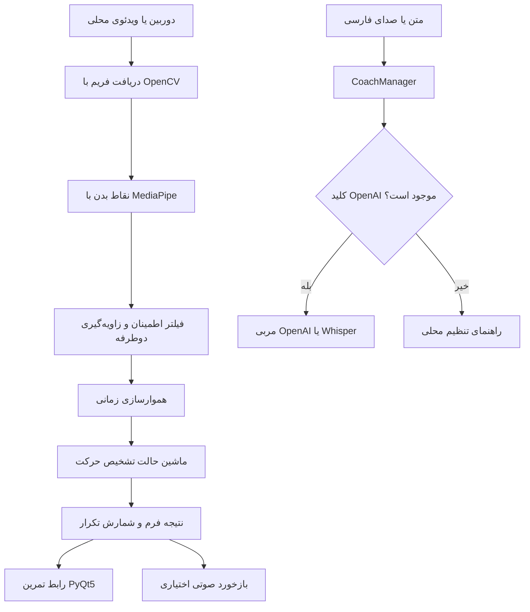

# Smart Coach

Smart Coach یک برنامه دسکتاپ پایتونی برای تحلیل حرکات ورزشی، شمارش تکرارها و دریافت راهنمایی هوشمند است.

> این پروژه ابزار آموزشی است و جایگزین مربی حرفه‌ای یا توصیه پزشکی نیست.

<p align="center">
  <a href="https://github.com/Hosseinghorbani0/Smart-Coach/actions"></a>
  <a href="https://img.shields.io/badge/license-MIT-green.svg"></a>
</p>

**مستندات:** [English](README.md) | [فارسی](README_FA.md)

## فهرست هفت‌بخشی

1. [معرفی و قابلیت‌ها](#معرفی-و-قابلیت‌ها)
2. [معماری و فلوچارت](#معماری-و-فلوچارت)
3. [تحلیل حرکات](#تحلیل-حرکات)
4. [نیازمندی‌ها و نصب](#نیازمندی‌ها-و-نصب)
5. [پیکربندی و اجرا](#پیکربندی-و-اجرا)
6. [توسعه و تست](#توسعه-و-تست)
7. [خطایابی، مشارکت و مجوز](#خطایابی-مشارکت-و-مجوز)

## معرفی و قابلیت‌ها

این سیستم با استفاده از OpenCV، MediaPipe، PyTorch و PyQt5، تصویر دوربین یا ویدئوی محلی را تحلیل می‌کند و برای چهار حرکت اصلی بازخورد می‌دهد.

## معماری و فلوچارت

رابط دسکتاپ سه بخش اصلی دارد: صفحه خانه، صفحه تمرین و صفحه مربی. فلوچارت زیر مسیر تحلیل تصویر و مسیر چت هوشمند را نشان می‌دهد:



فایل‌های موقت داخل `storage/` قرار می‌گیرند و اطلاعات محرمانه و فایل‌های حجیم وارد Git نمی‌شوند.

## تحلیل حرکات

الگوریتم فعلی چند مرحله دارد:

| مرحله | هدف |
| --- | --- |
| اطمینان نقاط بدن | نقاطی که visibility پایینی دارند وارد محاسبه نمی‌شوند. |
| اندازه‌گیری دوطرفه | زاویه زانو، آرنج و لگن از هر دو سمت بدن میانگین‌گیری می‌شود. |
| هموارسازی زمانی | پرش‌های ناگهانی ناشی از نویز MediaPipe کاهش پیدا می‌کند. |
| تأیید شروع | شروع حرکت به سه فریم متوالی مشابه نیاز دارد. |
| تأیید پایان | پایان حرکت نیز باید در سه فریم متوالی پایدار باشد. |
| بررسی مدل | پنجره ۳۲ فریمی با مدل آموزش‌دیده بررسی می‌شود. |

حرکت‌های پشتیبانی‌شده شامل اسکات، پوش‌آپ، پول‌آپ و ددلیفت هستند. نور مناسب، دیده‌شدن کامل بدن و ثابت بودن دوربین معمولاً بیشتر از افزایش کورکورانه آستانه‌ها روی دقت اثر دارند.

## نیازمندی‌ها و نصب

نیازمندی‌های اصلی پروژه عبارت‌اند از Python 3.9 یا بالاتر، حداقل ۸ گیگابایت RAM، دوربین برای اجرای زنده و میکروفون اختیاری برای قابلیت‌های صوتی. Python 3.11 برای وابستگی فعلی پیشنهاد می‌شود.

### Windows PowerShell

```powershell
git clone https://github.com/Hosseinghorbani0/Smart-Coach.git
Set-Location Smart-Coach
py -3.11 -m venv .venv
.\.venv\Scripts\Activate.ps1
python -m pip install --upgrade pip
python -m pip install -r requirements.txt
Copy-Item .env.example .env
python main.py
```

### Linux و macOS

```bash
git clone https://github.com/Hosseinghorbani0/Smart-Coach.git
cd Smart-Coach
python3 -m venv .venv
source .venv/bin/activate
python -m pip install --upgrade pip
python -m pip install -r requirements.txt
cp .env.example .env
python main.py
```

برای اجرای زنده دوربین لازم است؛ برای تحلیل آفلاین می‌توان فایل‌های `.mp4`، `.avi` یا `.mkv` را انتخاب کرد. GPU اختیاری است و تحلیل CPU نیز پشتیبانی می‌شود.

## پیکربندی و اجرا

فایل `.env.example` را به `.env` کپی کنید. کلید واقعی را هرگز commit نکنید:

```dotenv
SMART_COACH_OPENAI_API_KEY=your_key_here
```

متغیر استاندارد `OPENAI_API_KEY` نیز پذیرفته می‌شود. اگر کلید وجود نداشته باشد، تحلیل حرکات همچنان اجرا می‌شود و فقط قابلیت‌های مربی هوشمند و تبدیل صدا غیرفعال خواهند بود.

برای انتقال داده‌های runtime به مسیر دیگر:

```dotenv
SMART_COACH_BASE_DIR=C:\Users\YourName\SmartCoachData
```

### گردش کار برنامه

1. `python main.py` را اجرا کنید.
2. از صفحه خانه گزینه **تمرین کردن** را انتخاب کنید.
3. تشخیص خودکار یا حرکت مشخص را انتخاب کنید.
4. دوربین را شروع کنید یا یک ویدئوی محلی انتخاب کنید.
5. برای چت فارسی، صفحه مربی را باز کنید.

برای دقت بهتر، کل بدن باید در تصویر باشد، نور کافی باشد و دوربین ثابت بماند.

## توسعه و تست

ساختار اصلی کد به این شکل است:

```text
core/             تنظیمات، مربی هوشمند، صدا و تاریخچه چت
processes/        تشخیص حرکت، مدل PyTorch و بازخورد صوتی
ui/               صفحه خانه، تمرین، مربی و ضبط صدا
Model_training/   دیتاست و ابزارهای آموزش مدل
tests/            تست‌های پیکربندی، مدل و detector
```

برای اجرای همه تست‌ها:

```bash
python -m pytest -q
```

برای تست بخش‌های مشخص:

```bash
python -m pytest -q tests/test_config.py
python -m pytest -q tests/test_model.py
python -m pytest -q tests/test_detector.py
```

فرآیند CI نیز syntax پایتون، نام‌های تعریف‌نشده و تست‌ها را بررسی می‌کند.

## خطایابی، مشارکت و مجوز

راهنمای خطایابی، مشارکت و مجوز پروژه در بخش هفتم تکمیل می‌شود.
